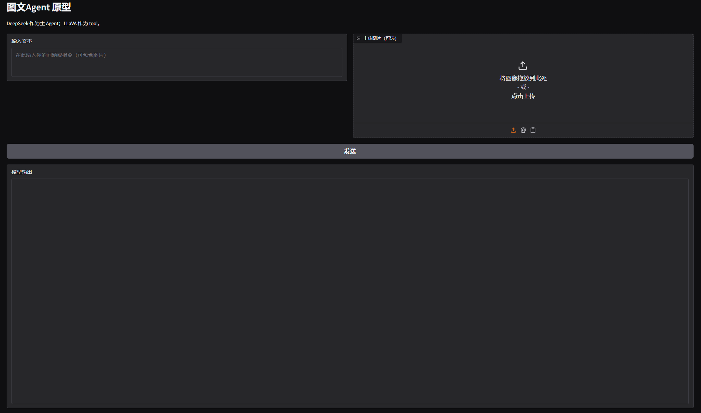

# Offline text-vision agent ~~(with some bugs unfixed)~~
## You can install by follows steps
1. This project is based on [Ollama](https://ollama.com/download). You need to install it first.

    You may change the Ollama install and download place as you like.
   
2. Download model from [Ollama](https://ollama.com/search), like [DeepSeek](https://ollama.com/library/deepseek-r1), [LLaVA](https://ollama.com/library/llava), by follows CLI:
  ``` bash
  ollama run deepseek-r1
  ollama run llava
  ```
  At least one vision model and one general model are required, and there must be a "tool" label (you can see it on the model download page). 
  
  ~~I haven't test what would happen without the "tool" tag.~~

3. Clone the code:
  ``` bash
  git clone https://github.com/Gryphonh/Offline-Agent-test.git
  cd Offline-Agent-test
  ```

4. Create an env for the code:
  ``` bash
  conda create -n agent python=3.10
  conda activate agent
  pip install requirements.txt
  ```

5. Edit the config.py as you prefer. (I mean the model you downloaded.)
 ``` python
 CONTROLLER_MODEL = "deepseek-r1:8b"  # general LLM
 VISION_MODEL = "llava:7b"         # vision LLM
 ```

6. Run the main.py
  ``` bash
  python main.py
  ```
  Use your web browser to open the corresponding port (default 127.0.0.1:7860).
  
  You will see the web GUI like:
  
  
  
  Now enjoy and have fun!
